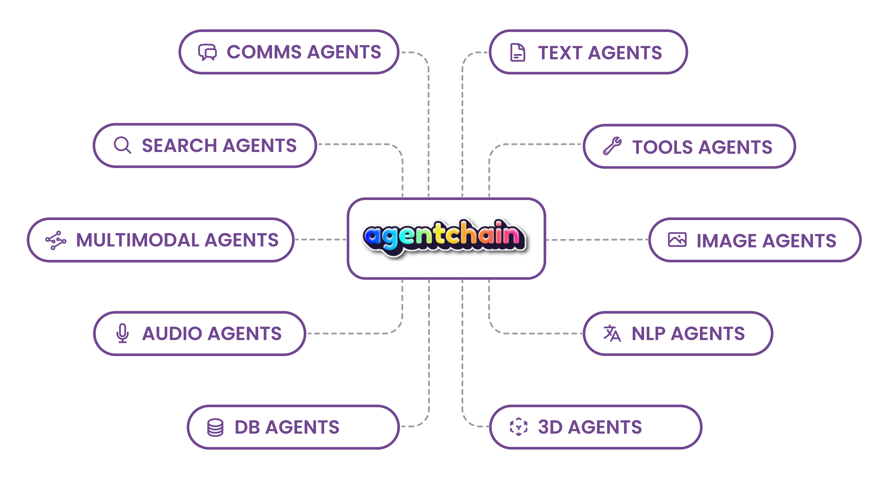

</a>

AgentChain uses Large Language Models (LLMs) for reasoning and orchestrating multiple LLMs or Large Models (LMs) for accomplishing sophisticated tasks. AgentChain is fully multimodal: it accepts text, image, audio, webcam, tabular data as input and output.

- **🧠 Leverage Large Language Models (LLMs):** AgentChain leverages state-of-the-art Large Language Models to provide users with the ability to reason and make decisions based on natural language inputs. This feature makes AgentChain a versatile tool for a wide range of applications, such as natural language processing, sentiment analysis, and chatbots.
- **🌟 Fully Multimodal:** AgentChain is fully multimodal, accepting input and output from various modalities, such as text, image, audio, or video. This feature makes AgentChain a versatile tool for a wide range of applications, such as computer vision, speech recognition, and multimodal fusion.
- **🤝 Orchestrate Multiple Agents:** AgentChain can orchestrate multiple agents to perform complex tasks, making it a powerful tool for projects that require extensive research, data analysis, or computation. This feature makes AgentChain a versatile tool for a wide range of applications, such as e-commerce, finance, healthcare, and more.
- **🔧 Customizable for Specific Project Requirements:** AgentChain can be customized to fit specific project requirements, making it a versatile tool for a wide range of applications. The system can work with different programming languages, APIs, and platforms, providing maximum flexibility and adaptability.

# Demo

# Agents in AgentChain

AgentChain is a sophisticated system that can orchestrate multiple agents to accomplish sophisticated tasks. These agents are organized into different groups, each with their unique set of capabilities and functionalities. Here are the five agent groups in AgentChain:

### SearchAgents
The `SearchAgents` group is responsible for gathering information from various sources, including search engines, online databases, and APIs. The agents in this group are highly skilled at retrieving and parsing data, making them essential for tasks that require extensive research and data analysis. Some examples of agents in this group include the `Google Search API`, `Bing API`, `Wikipedia API`, and `Serp`.

### CommsAgents
The `CommsAgents` group is responsible for handling communication between different parties, such as sending emails, making phone calls, or messaging via various platforms. The agents in this group are highly skilled at handling different communication channels and can integrate with a wide range of platforms. Some examples of agents in this group include `TwilloCaller`, `TwilloEmailWriter`, and `TwilloMessenger`.

### ToolsAgents
The `ToolsAgents` group is responsible for performing various computational tasks, such as performing calculations, running scripts, or executing commands. The agents in this group are highly versatile and can work with a wide range of programming languages and tools. Some examples of agents in this group include `Math`, `Python REPL`, and `Terminal`.

### MultiModalAgents
The `MultiModalAgents` group is responsible for handling input and output from various modalities, such as text, image, audio, or video. The agents in this group are highly skilled at processing and understanding different modalities, making them essential for tasks that require multimodal input or output. Some examples of agents in this group include `OpenAI Whisper`, `Blip2`, `Coqui`, `ControlNet`, and `StableDiffusion`.

### ImageAgents
The `ImageAgents` group is responsible for processing and manipulating images, such as enhancing image quality, object detection, or image recognition. The agents in this group are highly skilled at working with image data and can perform complex operations on them. Some examples of agents in this group include `Upscaler` and `YOLO`.

# Examples

### Example 1: 🏝️📸🌅 AgentChain Image Generation System for Travel Company
As a travel company that is promoting a new and exotic destination, it is crucial to have high-quality images that can grab the attention of potential travelers. However, manually creating stunning images can be time-consuming and expensive. That's why the travel company wants to use AgentChain to automate the image generation process and create beautiful visuals with the help of various agents.

Here is how AgentChain can help by chaining different agents together:
1. Use `SearchAgent` (`Google Search API`, `Wikipedia API`, `Serp`) to gather information and inspiration about the destination, such as the most popular landmarks, the local cuisine, and the unique features of the location.
2. Use `ImageAgent` (`Upscaler`) to enhance the quality of images and make them more appealing by using state-of-the-art algorithms to increase the resolution and remove noise from the images.
3. Use `MultiModalAgent` (`OpenAI Whisper`) to generate descriptive captions for the images, providing more context and making the images more meaningful.
4. Use `CommsAgent` (`TwilloEmailWriter`) to send the images to the target audience via email or other messaging platforms, attracting potential travelers with stunning visuals and promoting the new destination.

### Example 2: 💼💹📈 AgentChain Financial Analysis Report for Investment Firm
As an investment firm that manages a large portfolio of stocks, it is critical to stay up-to-date with the latest market trends and analyze the performance of different stocks to make informed investment decisions. However, analyzing data from multiple sources can be time-consuming and error-prone. That's why the investment firm wants to use AgentChain to automate the analysis process and generate reports with the help of various agents.

Here is how AgentChain can help by chaining different agents together:
1. Use `ToolsAgent` (`Python REPL`) to analyze data from different sources (e.g., CSV files, stock market APIs) and perform calculations related to financial metrics such as earnings, dividends, and P/E ratios.
2. Use `SearchAgent` (`Bing API`) to gather news and information related to the stocks in the portfolio, such as recent earnings reports, industry trends, and analyst ratings.
3. Use `MultiModalAgent` (`ControlNet`) to perform sentiment analysis on the news and information gathered, providing insights into market sentiment and potential trends.
4. Use `CommsAgent` (`TwilloEmailWriter`) to send a summary report of the analysis to the appropriate stakeholders, helping them make informed decisions about their investments.

### Example 3: 🛍️💬💻 AgentChain Customer Service Chatbot for E-commerce Site
As an e-commerce site that wants to provide excellent customer service, it is crucial to have a chatbot that can handle customer inquiries and support requests in a timely and efficient manner. However, building a chatbot that can understand and respond to complex customer requests can be challenging. That's why the e-commerce site wants to use AgentChain to automate the chatbot process and provide superior customer service with the help of various agents.

Here is how AgentChain can help by chaining different agents together:
1. Use `MultiModalAgent` (`Blip2`) to handle input from various modalities (text, image, audio, webcam), making it easier for customers to ask questions and make requests in a natural way.
2. Use `SearchAgent` (`Google Search API`, `Wikipedia API`) to provide information about products or services, such as specifications, pricing, and availability.
3. Use `CommsAgent` (`TwilloMessenger`) to communicate with customers via messaging platforms, providing support and answering questions in real-time.
4. Use `ToolsAgent` (`Math`) to perform calculations related to discounts, taxes, or shipping costs, helping customers make informed decisions about their purchases.
5. Use `MultiModalAgent` (`Coqui`) to generate natural-sounding responses and hold more complex conversations, providing a personalized and engaging experience for customers.

### Example 4: 🧑‍⚕️💊💤 AgentChain Personal Health Assistant for Aging Population
As an organization that provides support for seniors who want to live independently, it is essential to have a personal health assistant that can help seniors manage their health and well-being. However, providing personalized health advice and reminders can be challenging, especially for seniors who may have different health needs and preferences. That's why the organization wants to use AgentChain to automate the health assistant process and provide personalized support with the help of various agents.

Here is how AgentChain can help by chaining different agents together:
1. Use `MultiModalAgent` (`StableDiffusion`) to handle input from various health monitoring devices (e.g., heart rate monitors, blood pressure monitors, sleep trackers), providing real-time health data and alerts to the health assistant.
2. Use `SearchAgent` (`Google Search API`, `Wikipedia API`) to provide information about health topics and medications, such as side effects, dosage, and interactions.
3. Use `ToolsAgent` (`Python REPL`) to perform calculations related to medication dosages or nutritional requirements, providing personalized advice and reminders to seniors.
4. Use `MultiModalAgent` (`ControlNet`) to generate personalized recommendations for diet, exercise, and medication, taking into account the seniors' health goals and preferences.
5. Use `CommsAgent` (`TwilloCaller`) to make reminders and provide alerts to help seniors stay on track with their health goals, improving their quality of life and reducing the need for emergency care.

# Get started

## Acknowledgement
We appreciate the open source of the following projects:

[Hugging Face](https://github.com/huggingface) &#8194;
[LangChain](https://github.com/hwchase17/langchain) &#8194;
[Stable Diffusion](https://github.com/CompVis/stable-diffusion) &#8194; 
[ControlNet](https://github.com/lllyasviel/ControlNet) &#8194; 
[InstructPix2Pix](https://github.com/timothybrooks/instruct-pix2pix) &#8194; 
[CLIPSeg](https://github.com/timojl/clipseg) &#8194;
[BLIP](https://github.com/salesforce/BLIP) &#8194;
[Microsoft](https://github.com/microsoft/visual-chatgpt) &#8194;

