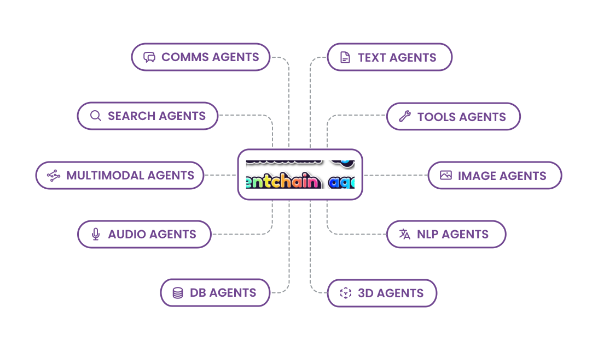

<p>
</a>
</p>

AgentChain uses Large Language Models (LLMs) for planning and orchestrating multiple Agents or Large Models (LMs) for accomplishing sophisticated tasks. AgentChain is fully multimodal: it accepts text, image, audio, tabular data as input and output.

- **🧠 LLMs as the brain:** AgentChain leverages state-of-the-art Large Language Models to provide users with the ability to plan and make decisions based on natural language inputs. This feature makes AgentChain a versatile tool for a wide range of applications, such as task execution give natural language instructions, data understanding, and data generation.
- **🌟 Fully Multimodal IO:** AgentChain is fully multimodal, accepting input and output from various modalities, such as text, image, audio, or video (coming soon). This feature makes AgentChain a versatile tool for a wide range of applications, such as computer vision, speech recognition, and transitioning from one modality to another.
- **🤝 Orchestrate Versatile Agents:** AgentChain can orchestrate multiple agents to perform complex tasks. Using composability and hierarchical structuring of tools AgentChain can choose intelligently which tools to use and when for a certain task. This feature makes AgentChain a powerful tool for projects that require complex combination of tools.
- **🔧 Customizable for Ad-hoc Needs:** AgentChain can be customized to fit specific project requirements, making it a versatile tool for a wide range of applications. Specific requirements can be met by enhancing capabilities with new agents (and distributed architecture coming soon).


# Get started
1. Install requirements: `pip install -r requirements.txt`
2. Download model checkpoints: `bash download.sh`
3. Depending on the agents you need in-place, make sure to export environment variables

```shell
OPENAI_API_KEY={YOUR_OPENAI_API_KEY} # mandatory since the LLM is central in this application
SERPAPI_API_KEY={YOUR_SERPAPI_API_KEY}  # make sure to include a serp API key in case you need the agent to be able to search the web

# These environment variables are needed in case you want the agent to be able to make phone calls
AWS_ACCESS_KEY_ID={YOUR_AWS_ACCESS_KEY_ID}
AWS_SECRET_ACCESS_KEY={YOUR_AWS_SECRET_ACCESS_KEY}
TWILIO_ACCOUNT_SID={YOUR_TWILIO_ACCOUNT_SID}
TWILIO_AUTH_TOKEN={YOUR_TWILIO_AUTH_TOKEN}
AWS_S3_BUCKET_NAME={YOUR_AWS_S3_BUCKET_NAME} # make sure to create an S3 bucket with public access
```
4. Install `ffmpeg` library (needed for whisper): `sudo apt update && sudo apt install ffmpeg` (Ubuntu command)
5. Run the main script: `python main.py`


# Demo


AgentChain demo 1: transcribing audio and visualizing the result as an image. A video of the AgentChain interface shows an uploaded audio and the resulting generated image, which is a representation of the audio content.

https://user-images.githubusercontent.com/2041322/224827172-ca038ffc-ebe2-42e7-9bcd-7f26c6be0358.mp4

---

AgentChain demo 2: asking questions about an image. A video of the AgentChain interface shows an image and a question being asked about it, with the resulting answer displayed below.

https://user-images.githubusercontent.com/2041322/224823758-75be4ac9-6572-4d77-94b7-8b63c6ea4be3.mp4

---

AgentChain demo 3: question-answering on tabular data and making a phone call to report the results. A video of the AgentChain interface shows a table of data with a question being asked and the resulting answer displayed, followed by a phone call being made using the `CommsAgent`.


https://user-images.githubusercontent.com/2041322/224829592-b37d04fc-8c86-4fcf-ab0c-a9001c7cc4e7.mp4


# Agents in AgentChain

> The content of this document mostly shows **our vision** and **what we aim to achieve** with AgentChain.
Check the Demo section to understand what we achieved so far.



AgentChain is a sophisticated system with the goal of solving general problems. It can orchestrate multiple agents to accomplish sub-problems. These agents are organized into different groups, each with their unique set of capabilities and functionalities. Here are some of the agent groups in AgentChain:

### SearchAgents
The `SearchAgents` group is responsible for gathering information from various sources, including search engines, online databases, and APIs. The agents in this group are highly skilled at retrieving up-to-date world knowledge information. Some examples of agents in this group include the `Google Search API`, `Bing API`, `Wikipedia API`, and `Serp`.

### CommsAgents
The `CommsAgents` group is responsible for handling communication between different parties, such as sending emails, making phone calls, or messaging via various platforms. The agents in this group can integrate with a wide range of platforms. Some examples of agents in this group include `TwilioCaller`, `TwilioEmailWriter`, `TwilioMessenger` and `Slack`.

### ToolsAgents
The `ToolsAgents` group is responsible for performing various computational tasks, such as performing calculations, running scripts, or executing commands. The agents in this group can work with a wide range of programming languages and tools. Some examples of agents in this group include `Math`, `Python REPL`, and `Terminal`.

### MultiModalAgents
The `MultiModalAgents` group is responsible for handling input and output from various modalities, such as text, image, audio, or video (coming soon). The agents in this group can process and understand different modalities. Some examples of agents in this group include `OpenAI Whisper`, `Blip2`, `Coqui`, and `StableDiffusion`.

### ImageAgents
The `ImageAgents` group is responsible for processing and manipulating images, such as enhancing image quality, object detection, or image recognition. The agents in this group can perform complex operations on images. Some examples of agents in this group include `Upscaler`, `ControlNet` and `YOLO`.

### DBAgents
The `DBAgents` group is responsible for adding and fetching data from your database, such as getting metrics or aggregations from your database. The agents in this group interact with databases and enrich other agents with your database information. Some examples of agents in this group include `SQL`, `MongoDB`, `ElasticSearch`, `Qrant` and `Notion`.


# Potential Applications

### Example 1: 🏝️📸🌅 AgentChain Image Generation System for Travel Company
As a travel company that is promoting a new and exotic destination, it is crucial to have high-quality images that can grab the attention of potential travelers. However, manually creating stunning images can be time-consuming and expensive. That's why the travel company wants to use AgentChain to automate the image generation process and create beautiful visuals with the help of various agents.

Here is how AgentChain can help by chaining different agents together:
1. Use `SearchAgent` (`Google Search API`, `Wikipedia API`, `Serp`) to gather information and inspiration about the destination, such as the most popular landmarks, the local cuisine, and the unique features of the location.
2. Use `ImageAgent` (`Upscaler`) to enhance the quality of images and make them more appealing by using state-of-the-art algorithms to increase the resolution and remove noise from the images.
3. Use `MultiModalAgent` (`Blip2`) to generate descriptive captions for the images, providing more context and making the images more meaningful.
4. Use `CommsAgent` (`TwilioEmailWriter`) to send the images to the target audience via email or other messaging platforms, attracting potential travelers with stunning visuals and promoting the new destination.

### Example 2: 💼💹📈 AgentChain Financial Analysis Report for Investment Firm
As an investment firm that manages a large portfolio of stocks, it is critical to stay up-to-date with the latest market trends and analyze the performance of different stocks to make informed investment decisions. However, analyzing data from multiple sources can be time-consuming and error-prone. That's why the investment firm wants to use AgentChain to automate the analysis process and generate reports with the help of various agents.

Here is how AgentChain can help by chaining different agents together:
1. Use `ToolsAgent` (`Python REPL`, `TableQA`) to analyze data from different sources (e.g., CSV files, stock market APIs) and perform calculations related to financial metrics such as earnings, dividends, and P/E ratios.
2. Use `SearchAgent` (`Bing API`) to gather news and information related to the stocks in the portfolio, such as recent earnings reports, industry trends, and analyst ratings.
3. Use `NLPAgent` (`GPT`) to create a summary and bullet points of the news and information gathered, providing insights into market sentiment and potential trends.
4. Use `CommsAgent` (`TwilioEmailWriter`) to send a summary report of the analysis to the appropriate stakeholders, helping them make informed decisions about their investments.

### Example 3: 🛍️💬💻 AgentChain Customer Service Chatbot for E-commerce Site
As an e-commerce site that wants to provide excellent customer service, it is crucial to have a chatbot that can handle customer inquiries and support requests in a timely and efficient manner. However, building a chatbot that can understand and respond to complex customer requests can be challenging. That's why the e-commerce site wants to use AgentChain to automate the chatbot process and provide superior customer service with the help of various agents.

Here is how AgentChain can help by chaining different agents together:
1. Use `MultiModalAgent` (`Blip2`, `Whisper`) to handle input from various modalities (text, image, audio), making it easier for customers to ask questions and make requests in a natural way.
2. Use `SearchAgent` (`Google Search API`, `Wikipedia API`) or `DBAgent` to provide information about products or services whether in-house or public, such as specifications, pricing, and availability.
3. Use `CommsAgent` (`TwilioMessenger`) to communicate with customers via messaging platforms, providing support and answering questions in real-time.
4. Use `ToolsAgent` (`Math`) to perform calculations related to discounts, taxes, or shipping costs, helping customers make informed decisions about their purchases.
5. Use `MultiModalAgent` (`Coqui`) to generate natural-sounding responses and hold more complex conversations, providing a personalized and engaging experience for customers.

### Example 4: 🧑‍⚕️💊💤 AgentChain Personal Health Assistant
Access to personal health assistance can be expensive and limited. It is essential to have a personal health assistant that can help individuals manage their health and well-being. However, providing personalized health advice and reminders can be challenging, especially for seniors. That's why AgentChain aims to automate the health assistant process and provide personalized support with the help of various agents.

Here is how AgentChain can help by chaining different agents together:
1. Use `DBAgent` to handle input from various health monitoring devices (e.g., heart rate monitors, blood pressure monitors, sleep trackers), providing real-time health data and alerts to the health assistant.
2. Use `SearchAgent` (`Google Search API`, `Wikipedia API`) or any other medical database to provide information about health topics and medications, such as side effects, dosage, and interactions.
3. Use `NLPAgent` (`GPT`) to generate personalized recommendations for diet, exercise, and medication, taking into account the seniors' health goals and preferences.
4. Use `CommsAgent` (`TwilioCaller`, `TwilioMessenger`) to advise, make reminders and provide alerts to help stay on track with their health goals, improving their quality of life and reducing the need for emergency care.


## System requirements
As of [this commit](https://github.com/jina-ai/agentchain/commit/da588a728c390fb538fd361d4f41dd50aa193751), it is needed to have at least 29 GB of GPU memory to run the AgentChain.
However, make sure to assign GPU devices correctly in `main.py`.

You can comment out some tools and models to reduce the GPU memory footprint (but for less capabilities).

## Acknowledgements
We appreciate the open source of the following projects:

[Hugging Face](https://github.com/huggingface) &#8194;
[LangChain](https://github.com/hwchase17/langchain) &#8194;
[Stable Diffusion](https://github.com/CompVis/stable-diffusion) &#8194; 
[ControlNet](https://github.com/lllyasviel/ControlNet) &#8194; 
[InstructPix2Pix](https://github.com/timothybrooks/instruct-pix2pix) &#8194; 
[CLIPSeg](https://github.com/timojl/clipseg) &#8194;
[BLIP](https://github.com/salesforce/BLIP) &#8194;
[Microsoft](https://github.com/microsoft/visual-chatgpt) &#8194;
